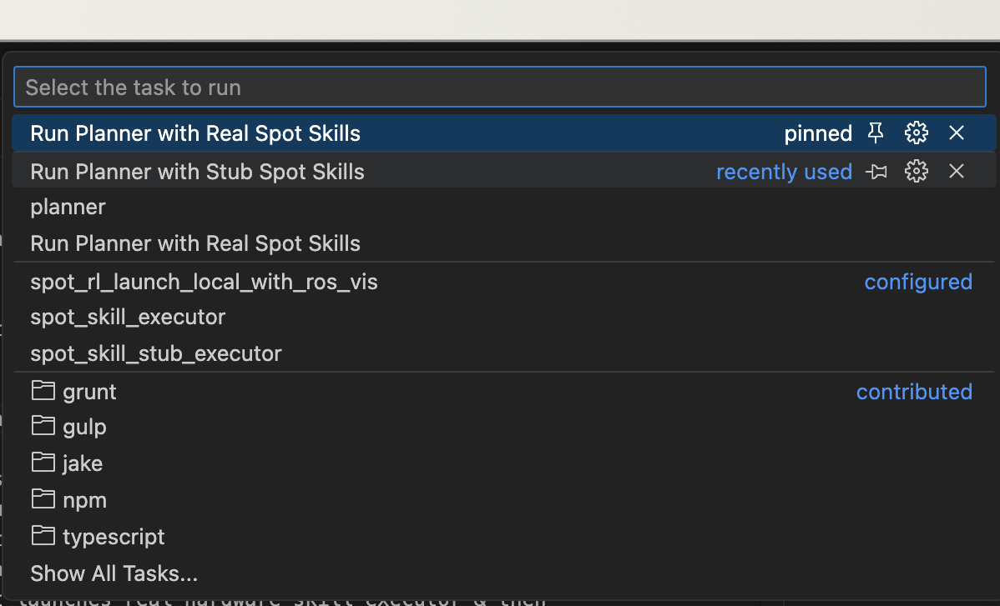

## What is Tasks json 
    Vscode allows automating launching/building of processes/code. 
    At the same time gives us significant control over the lifecycle of these processes.
    Overall less code cluttter & launch commands.
    
## How to run task
    Single Click on 'Terminal' in Vscode an options box will open click on the 'Run Task' option, it will show you available tasks to run you can choose from two options
    1. Run Planner with Stub Spot Skillsr : Runs spot_rl_launch_local with visualizer then runs stub skill executor & then finally planner. 
    2. Run Planner with Real Spot Skills: Runs spot_rl_launch_local with visualizer as above but launches real hardware skill executor & then planner. 

    See the following images 

   

## How to define planner path & spot-sim2real env names & other customizations etc. 
### Important
    Since habitat planner could be stored in different local paths & env names might different. 
    We have '.env' file in .vscode folder please open it & edit your local paths & conda env names there. 

### Optional Customization of tasks.json
    For more customization please edit tasks.json, for instance currently it executes 'scripts/run_react_fre_planner.sh' from habitat-llm root folder. 
    If you want it to run other planner script edit roughly the line 64 at appropriate place in the task labelled as 'planner'. 
    
    Currently to handle conda issues in vscode terminal environment I had to activate conda.sh & then activate particular env, adding little more steps than just running the bash <planner_scipt.sh>

    Feel free to take a look at tasks.json & edit the behaviour of launching other tasks as required.