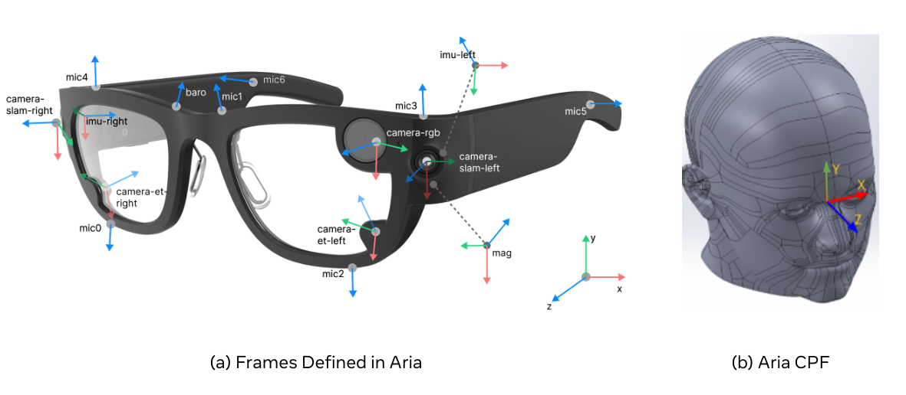
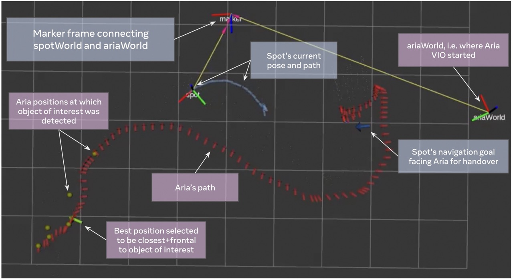

# Episodic Memory, Robotic Fetch: Entry-point and included python classed to work with Aria-glasses

Project aria already exposes [basic data
utilities for working with VRS files](https://facebookresearch.github.io/projectaria_tools/docs/data_utilities).
This package adds wrappers which work with live Aria and communicate with Spot. We also implements data-loaders on top of prior utilities to make multi-modal data access and processing easier. Thus this package supports working with both offline and online Aria datastreams.

## Installation for use with Spot-Sim2Real

1. Activate the conda environment:

```bash
conda activate spot_ros
```

2. Installing FairOtag for QR code detection
Run these commands from outside of spot-sim2real
```bash
git clone -b fairo_viz_subplots git@github.com:KavitShah1998/fairo.git
cd fairo/perception/fairotag/
pip install -e .
```

3. Install aria_data_loaders package (will also install requirements)

```bash
# Make sure you are in the root of aria_data_loaders dir
pip install -e .

cd ../spot_rl_experiments/
pip install -e .
```

## Installation (for stand-alone use)

1. Create the conda env:

```bash
conda create -n aria_env -y python=3.9
conda activate aria_env
```

Follow steps 2 and 3 from above.

## Reference Frames used for Multi-agent Registration

#### TF Frames used for Spot-Aria integration
- map:        RVIZ map frame (necessary as this acts as root node in tf tree). Always exists with rviz
- spotWorld:  Spot's world frame (defined by where spot's home is reset). The local_launch shell script publishes a static tf of spotWorld wrt map
- spot:       Spot's base frame (defined by current location of spot). This frame is published by Proprioception node in local_launch shell script
- marker:     Marker frame (defined by the center of spot dock's april tag). This frame is published by Episodic_memory_robotic_fetch node at the start of the node when spot looks at the marker and detects it
- ariaWorld:  Aria's world frame (origin as the location where Aria's SLAM starts). This frame is published by AriaLiveReader node
- aria:       Aria's current pose (defined by its Central Pupil Frame, CPF, see (b)
  illustration below ). This frame is published by AriaLiveReader node everytime it receives
  a `device-pose` from Aria.

#### Aria's internal frames (for information only):
- CPF: Center frame of Aria with Z pointing out, X pointing up and Y pointing left
- `device-pose`: Base frame of Aria which is aligned with left-slam camera frame (see
  Aria's Frames illustrated below (a))

  

#### Spot's internal frames (for information only):
- body: Base frame of Spot. This frame is also the central frame on spot. More info can be found [here](https://dev.bostondynamics.com/docs/concepts/geometry_and_frames#frames-in-the-spot-robot-world)
- vision: World frame of Spot. This world frame is computed relative to "body" frame using vision and odometry as mentioned [here](https://dev.bostondynamics.com/docs/concepts/geometry_and_frames#frames-in-the-spot-robot-world)
- odom: World frame of Spot. This world frame is computed relative to "body" frame using kinematics of robot as mentioned [here](https://dev.bostondynamics.com/docs/concepts/geometry_and_frames#frames-in-the-spot-robot-world)
hand_color_image_sensor: Arm camera sensor frame on robot. This is the frame in which arm camera image responses are captured in.

#### More information
- All transformations in the repo are represented as `a_T_b` where b is the local frame and a is the global frame.
- Eg: vision_T_body for spot represents spot's body frame as seen in spot's vision (world) frame.
- Libraries :
    - Sophuspy - primarily used (and encouraged to be used) for any form of transformations on Aria and QR detection modules
    - Magnum - currently used as a transformation engine mainly within `spot_rl_experiments`. Will be deprecated soon.
    - BD - information about transforms obtained from BD APIs on spot uses BD's transformation library. It can be convered to sophuspy using library conversions available in `conversions.py` file.
    - ROS - mainly used for data transfer via ROS topics and static transforms. It can be convered to sophuspy using library conversions available in `conversions.py` file.

## :scroll: Steps to Run Episodic Memory, Robotic Fetch Demostration

### Run ARIA - Spot Fetch tasks from LIVE Aria Stream
- This mode requires a Multi - PC setup.
    - PC #1 can be any Linux workstation that is capable to run low-level spot skills
    - PC #2 should be a linux laptop (with good compute) which **will run the live streamer code while connected to Aria device via USB**

#### Steps for PC #1
 - Follow steps 1-4 from [running ASC/LSC/Seq-experts demo](../README.md#running-the-demo-asclscseq-experts)

#### Step5. Run RVIZ visualization
- Open a new terminal and cd into root of spot-sim2real repo
- **Only if you have native ROS Noetic installation run the following steps to activate it**. Native ROS' RVIZ seems to behave better than the one inside virtual environment (from robostack).
    ```bash
    mamba deactivate
    source /opt/ros/noetic/setup.bash
    ```
- Run RVIZ for visualization along with the relevant .rviz config file
    ```bash
    rosrun rviz rviz -d ./aria_data_loaders/aria_data_utils/rviz/spot-aria.rviz
    ```

#### Step6. Run the Episodic Memory Robotic Fetch demo node
- Make sure robot is docked
- In a new terminal
    ```bash
    cd aria_data_loaders/aria_data_utils/
    python episodic_memory_robotic_fetch.py --verbose=True --use-policies=False
    ```
- Spot will standup from dock & navigate to the left of the dock & sit down so as to view the marker. (If you don't have space on left of dock, please update it inside `__init__` of `class EpisodicMemoryRoboticFetch` to `SPOT_DOCK_OBSERVER_WAYPOINT_RIGHT`)
- After you see `spot`, `spotWorld` and `marker` frames in RVIZ, you need to get Aria in the same frame system.
- Run the steps for PC#2 as described [below](#steps-for-pc-2) to enable Aria's streaming
- Once Aria's streaming has started and you are wearing Aria while having the PC#2 (i.e. laptop) in your bagback, **move to a place within 2m from spot's QR marker and view the QR code of spot's dock for 2 seconds**. Make sure you can also see `aria` & `ariaWorld` frames in the same RVIZ window and the odometry of aria constantly updating as you are moving.
- Also make sure that the frames in the system are making sense w.r.t. real world configuration
- Move in the environment and look at the object of interest from a good viewpoint from where spot can grasp it. You would see a green arrow appear at that location in RVIZ which showcases that system has locked on the object of interest at the shown pose.
- Move in the environment and finally sit a location where there is navigable space in front of you. You would see a purple arrow appear at that location in RVIZ which showcases that system has registered your last location as place location at the shown pose.
- Run [Step7](#step7-in-a-new-terminal-run-this-publisher-once-all-frames-are-registered-inside-rviz-and-spot-fetch-tasks-should-be-initialized) to initiate spot-fetch.

#### Step7. In a new terminal run this publisher once all frames are registered inside RVIZ and spot-fetch tasks should be initialized
 - Publish boolean to trigger demo
    ```bash
    rostopic pub /spot_fetch_trigger std_msgs/Bool "{ data: true }"
    ```

#### Steps for PC #2
- Make sure following requirements are met
    - [`projectaria_tools`](https://facebookresearch.github.io/projectaria_tools/docs/data_utilities/installation/installation_python#step-3--install-the-required-python-packages) and [`projectaria_client_sdk`](https://facebookresearch.github.io/projectaria_tools/docs/data_utilities/installation/installation_python#step-3--install-the-required-python-packages) are installed
    - Aria device is connected to the laptop and you can see it using `adb devices` command
    - Run `aria-doctor` command to ensure all basic setup is available ([more info](https://facebookresearch.github.io/projectaria_tools/docs/ARK/sdk/setup#step-2-run-project-aria-doctor-utility))
    - Run `aria-auth-pair` to pair the aria device with your laptop ([more info](https://facebookresearch.github.io/projectaria_tools/docs/ARK/sdk/setup#step-3-pair-aria-glasses-with-your-computer))
    - Generate Client SDK code samples following [this link](https://facebookresearch.github.io/projectaria_tools/docs/ARK/sdk/setup#step-4-extract-and-explore-the-sample-apps)

#### Step1. Enable Streaming with right profile on Aria
- In a new terminal run streaming on Aria connected via USB with profile9
    ```bash
    aria streaming start --interface usb --profile profile9
    ```
    You can find more info on profiles [here](https://facebookresearch.github.io/projectaria_tools/docs/ARK/glasses_manual/profile_guide)
- Make sure you are able to view the stream from Aria using the command; kill this node once you have verified that Aria is streaming data
    ```bash
    python -m streaming_subscribe
    ```

#### Step2. Run Off-the-shelf VIO for Aria
For people with internal access, please follow [this link](https://docs.google.com/document/d/1zeJC7KclbeOefBv9WXlTvMaC3CkI7xIEJ3fy2pqPRas/edit?usp=sharing) to know the steps for running SLAM on Aria.

For people without internal access, the SLAM pipeline might become available for use tentatively from February. Please bear with us until then.

#### Step3. Run Aria live streamer ROS node
- In a new terminal, run the following
    ```bash
    cd aria_data_loaders/aria_data_utils/
    python aria_live_streamer.py --do-update-iptables
    ```


### Run Aria - Spot Fetch tasks from a recorded VRS File

* To run the current spot-aria code, follow these steps

    ```bash
    # Go to the aria directory
    cd aria_data_loaders/

    # Run the aria_streamer.py file
    python aria_streamer.py --data-path="/path/to/directory/containing/vrs/and/mps/files" --vrs-name="name_of_vrs_file" --dry-run=False --verbose=True
    ```
    * Args:
        1. `--data-path` (Input: string): This is the path to the directory where VRS & MPS files reside. Make sure your VRS & MPS files for a trajectory co-exist in the same folder.
        2. `vrs-file` (Input: string): This is the name of the VRS file. Ignore the `.vrs` in the name of the file. For eg. if the name of VRS file is `sample_trajectory.vrs`, then the input will be like `--vrs-file="sample_trajectory"`. This file will be searched for within the directory specified with `--data-path`
        3. `--dry-run` (Input: bool): This is used to indicate if it should command robot to move or not. If dry run is true, then it will not send the commands to the robot to make it move. *But this will still require you to have robot watching the QR code for localizing itself in the system*.
        4. `--verbose` (Input: bool): This flag is for updating the visual stream with detections from both QR & object detectors.

## :bar_chart: Visualization Tools
We expose a few visualization tools as part of the Spot<>Aria stack, which can be used
with RViz (see figure below to see every element visualized by included [RViz configuration file](./aria_data_utils/rviz/spot-aria.rviz)):
- Spot-side: We publish Odometry messages on `/robot_odom` topic to plot Spot's path with respect
  to spotWorld
- Aria-side: We publish a Marker message on `/aria_pose_of_interest_marker` to visualize
  Aria's position when object-of-interest was detected
- Aria-side: We publish Odometry messages on `/aria_odom` topic to plot Aria's path with
  respect to spotWorld
- Aria-side: EMRoF driver script also publishes two topics of interest:
  `/nav_pose_for_pick_viz` and `/nav_pose_for_place_viz`. These poses show the exact
  navigation goals passed to Spot for picking and placing, respectively, in the fetching phase

  
