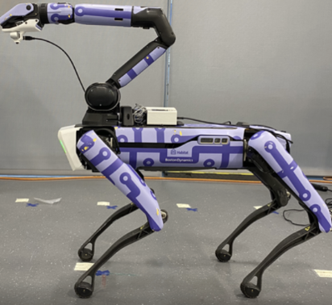
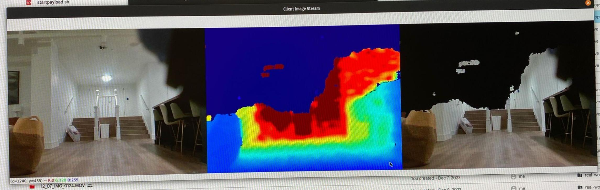

<!-- Copyright (c) Meta Platforms, Inc. and its affiliates.
This source code is licensed under the MIT license found in the
LICENSE file in the root directory of this source tree.
Reference code Boston Dynamics Spot-sdk: https://github.com/boston-dynamics/spot-sdk/tree/master/python/examples/web_cam_image_service -->

# Intel RealSense Image Service With Depth 

This code is a modified version of the [web-cam-service example](https://github.com/boston-dynamics/spot-sdk/tree/master/python/examples/web_cam_image_service) by Boston Dynamics Spot-SDK. This implements the standard Boston Dynamics API image service and communicates to Intel RealSense Camera using pyrealsense2 python package.
Contrary to this [web-cam-service example](https://github.com/boston-dynamics/spot-sdk/tree/master/python/examples/web_cam_image_service)
our modified service can also send depth images along with rgb images.
The `startpayload.sh` will run the `intelrealsense_image_service.py` locally. The image service is an implementation of the GRPC image service, which has the ListImageSources RPC and the GetImage RPC. The service can encode information from the Intel camera connection into a protobuf message.
   
## Prerequisites

#### Hardware Setup:
<br>
Connect spot core I/O on Spot's rear payload port.<br> 
Unscrew the black port cap protruding from its back & attach Spot GXP interface. This will have ethernet port to plug RJ45 cable & power cable coming out of the GXP that should power the SPOT CORE. <strong>Spot core will have two ethernet ports & innermost ethernet port should be connect with GXP using external RJ45 cable. This order is mandatory to work.</strong> <br>
<strong> Also don't forget to close the  spot payload cap as it's considered electric hazard & spot core won't turn on.</strong><br>
Get external usb wifi dongle, keyboard, mouse, hdmi cable & monitor to use Spot core as a desktop.<br>
Install Ubuntu if not installed already & the Ubuntu user should be named ```spot``` if anything different make sure to change the absolute paths in ```startpayload.sh & intelrealsensepayloadservice.service```  


## Software Setup SPOTCORE / Ubuntu / NUC+GXP machine steps:
Copy the folder ```intel_realsense_payload_for_spotsim2real``` to ```/home/spot/Desktop```
This service requires python & coda env named spot_ros (doesn't matter if exsists with some packages or you create a brand new).
Please follow necessary steps to install miniconda3 & create a spot_ros env if not present, then add `conda activate spot_ros` in `~/.bashrc` file.<br>
Using pip, install the dependencies:
```
python -m pip install -r requirements.txt
```

#### Optionally Install Librealsense package for Ubuntu to use realsense-viewer for advanced camera debugging
In addition to the pip-installable requirements, we need to connect the camera via USB & install librealsense package for IntelRealSense on Ubuntu  to use a utility called ``` realsense-viewer ``` which can be used to update camera firmware, check camera output, run on-chip self calibration  etc. It is not required for the ImageService but recommended if you wish to check on the camera calibration, debug camera etc.
Please follow these steps from the official Github channel to [install librealsense on Ubuntu](https://github.com/IntelRealSense/librealsense/blob/master/doc/distribution_linux.md)

#### Payload Registration
This example will run the service from a payload, which could be the CORE I/O or a different external computer; therefore, it will require knowing the guid, secret, and IP address of the computer the service will be running off of. 
Therefore please run 
``` 
python register_image_service_payload.py 
``` 
This payload will then need to be approved from Admin Web Interface of the Spot payload section before we can start executing the image service code.

#### Copy line 119 to 157 from bashrc.txt in your ~/.bashrc
These lines set the variables & useful aliases required to run the service like GUID, SECRET, running the service script as Ubuntu service, etc.

## Service Execution

After running the `startpayload.sh` clients will be able to send requests to this service through the robot.

Additionally you can also directly run :

```
python intelrealsense_image_service.py --guid $PAYLOAD_GUID --secret $PAYLOAD_SECRET --host-ip $PAYLOAD_IP --port $PAYLOAD_PORT $SPOT_IP --jpeg-quality 75 --res-width 640 --res-height 480 --socket-verification --show-debug-info 
```

The example can be safely exited by issuing a SIGINT (Ctrl + C) to the caller.
The last two flags ```--socket-verification``` (sends rgb image & depth over socket as well for pixel perfect verification) & ```--show-debug-info``` (plots openCV images) should be removed from final script run as those are only for debugging. 

## Client Execution
To verify if the above service is working correctly, we can launch ``` python spot-client.py ``` if everything works correctly this should render the cv2 window & plot RGB + Depth + RGB * DepthBinary images recived from the above service.
 
This should work locally as well as anywhere on the same network as Spot (like Desktop running spot-sim2real).It needs two OS variables to be set SPOT_IP & SPOT_ADMIN_PW. Its set on SPOT CORE I/O when we copied from ```bashrc.txt``` & it must also be set on spot-sim2real desktop (no change required).

Additionally you can use the flag ```python spot-client.py --verify-with-socket``` when running locally on spot core i/o. This also requires that you run the service with the flag ```--socket-verification```. This creates a socket between service script & the client script which is used to send same RGB & Depth images that are sent over gRPC calls so that client side can match the values recived & verify that nothing is wrong with encoding-decoding of the RPC calls. <strong> Please don't use this flag when testing over network & after final deployment of the service. Socket will be only created when this flag is on.</strong>

## Spot-sim2real integration with minimal changes (integrated in main, if you are on new branch then skip)
Since the entire design is same as Spot's default ImageService we can use that to our advantage to only change the function ```get_hand_images()``` fn in ```spot.py``` file.
By default ```get_hand_images()``` will return gripper camera images in case if the gripper camera is holding an object & internal holding flag is true this function will switch to intel realsense feed. Or you can request images from the source you need. If both sources are passed gripper & intelrealsense then output from both the sources will be returned.
We just need to create an additional image_client & remember image service name & image source names to fetch images from intel realsense.
Following is the code snippet
```
#create image client with our service name
image_client = robot.ensure_client('intel-realsense-image-service')

#create image request similar to get_hand_image function
imageresp_from_source = get_realsense_images(image_client=image_client, img_src=["intelrealsensergb", "intelrealsensedepth"])

#can parse intrinsics as we used to parse it from hand images
intrinsics = imageresp_from_source[0].source.pinhole.intrinsics

#Process images to obtain cv2 image object same function no change
images = [image_response_to_cv2(imgresp, False) for imgresp in imageresp_from_source]

#Plot
plot(images)
```


## Final Step : Running ImageService as Ubuntu service
It's essential that we run this as a Ubuntu service & it starts itself on startup or any failures such as camera disconnect, etc.
We followed this [simple tutorial](https://tecadmin.net/run-shell-script-as-systemd-service/) to setup the bash script as service on Ubuntu.
Assuming you have copied aliases from ```bashrc.txt``` in your ```~/.bashrc``` you can follow these simple steps to setup as a Ubuntu service:
```
#Make bash script executable
sudo chmod u+x startpayload.sh
#create a intelrealsensepayloadservice.service file in /lib/systemd/etc
payloadedit
copy & save the contents of intelrealsensepayloadservice.service into this file
payloadenable
payloadstart
#Check status of the service
payloadstatus
# Finally run spot-client.py with following alias
payloadtest
``` 
When spot starts, it will turn on the Spot CORE I/O & our payload service will be inturn started. 
<strong>Please disconnect & reconnect the IntelRealSense Camera after startup, I observed that after startup camera is not automatically detected by pyrealsense2 package.</strong> Since our Ubuntu service is confifured to restart on any failure after 3 secs, any disconnection & reconnection won't break the flow of the service.

## Software Setup for read-only (root) SPOTCORE IO / Jetson Xavier NX machine steps:
1. First make sure spot core io can connect to internet & you can ssh into it following [official SPOTCORE IO documentation](https://support.bostondynamics.com/s/article/Spot-CORE-I-O-User-Guide)<br>
2. Git clone spot-sim2real repo if it doesn't contain any folder containing name intel in it then switch to the branch intelrealsense-spotcoreio<br>
3. Install requirements.txt in your python3 by running ```pip3 install -r requirements.txt``` present in intel_realsense_payload_for_spotsim2real folder<br>
4. Add SPOT_IP & SPOT_ADMIN_PW in environment variables<br>
5. Run python3 register_image_service_payload.py to register the payload, approve payload from spot web panel
6. Edit startpayload.sh to configure your SPOT_ADMIN_PW & GUID, IP address etc.<br>
7. Run ```sudo docker build -t intelrealsensepayload .``` from intel_realsense_payload_for_spotsim2real folder, it will build a docker according to docker script present in Dockerfile, this will take 5-10 mins depending on your internet speed. The above docker is built on [NVIDIA jetson-containers github repo](https://github.com/dusty-nv/jetson-containers/tree/master)<br>
8. To run the image service from the docker run following command ```sudo docker run -it --rm --privileged --network host --device /dev:/dev intelrealsensepayload:latest```<br>
9. For now we can't automate the launch i.e. step-8 of intelrspayload service on boot as compared to spotcore or NUC machine thus service needs to be launched manually.<br>

## Caliberation from Intel to Gripper camera
1. Run caliberate_intel_with_gripper_cam.py from your local/ desktop spot-sim2real repo. Calibration requires fairotag repository mentioned in Aria data loaders folder ```git clone -b fairo_viz_subplots git@github.com:KavitShah1998/fairo.git && cd fairo/perception/fairotag/ && pip install -e .```. 
2. Above fairotag caliberation code requires you set the docker QR code closer/in front of gripper & intel camera. 
Please add appropriate DOCK_ID in ~/.bashrc otherwise code might fail
3. Run ```caliberate_intel_with_gripper_cam.py``` to caliberate where while loop will run continuously, in each step it will estimate the transform gripper_T_intel & find difference with previous estimates, once the error has reached 0. you can set rosparam is_save to 1 & while loop will stop & dump your best transform in gripper_T_intel.npy

## Debugging Tips

Here are a couple suggestions for debugging the web cam image service:

- Ensure the camera is powered on and plugged in.
- Check that your web cam is working separate from the api connections. For linux, the program `Cheese` allows you to stream from the camera. Run `cheese /dev/video0` (or the name of your cameras USB location) to verify the image appears.
- Use the command line argument `--show-debug-info` which will display the openCV capture output before encoded it into the image service protobuf message. If the image is unable to show here, then the device name is likely incorrect or unreachable.
- Check that the image service appears in the directory using the command line tool: `python3 -m bosdyn.client {ROBOT_IP} dir list`
- Use the [image service tester program](../tester_programs/README.md) to ensure the service can successfully be communicated with and that each RPC will complete correctly.
- When all tests pass for the image service tester program, check that the tablet is detecting the web cam image service by looking in the camera sources drop down menu (top-left of the status bar) and then check that the images are appearing by selecting the "Web Cam" camera source.